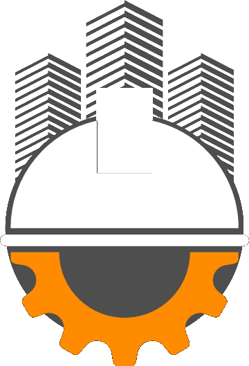
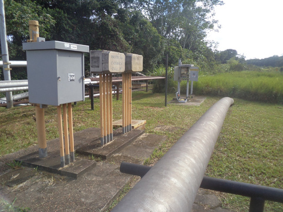

<div align="center">



# DW Projetos — Landing Page

**Proteção catódica, inspeção de revestimento, aterramento e SPDA para dutos e instalações industriais**

[](https://eliel2107.github.io/DWLandpage/)




</div>

---

## Sobre o projeto

Landing page institucional da **DW Projetos Empreendimentos Ltda**, empresa especializada em engenharia de proteção contra corrosão. A página apresenta os serviços, o método de inspeção, a experiência da equipe e um caminho direto para solicitação de orçamento, com foco em engenheiros de integridade e gestores de contratos do setor de óleo e gás.

A identidade visual segue o portfólio da empresa (grafite e laranja), com uma linguagem técnica e sóbria: tipografia de engenharia, numeração de seções, marcas de corte nas imagens e movimento suave em vez de efeitos chamativos.

> **Versão de apresentação.** Os textos entre `[colchetes]` aguardam informações do cliente — veja [Pendências](#-pendências).

## ✦ Destaques

- **Topo com apresentação de fotos** — troca automática com transição suave e zoom lento; pausa ao passar o mouse e retoma de onde parou.
- **Serviços interativos** — os quatro serviços avançam sozinhos quando a seção está visível, com barra de progresso; clique, teclado (← →) e pausa no mouse.
- **Figura técnica animada** — o diagrama de inspeção CIPS/DCVG do portfólio, redesenhado em vetor: o técnico percorre o duto, o perfil ON/OFF se desenha e as falhas de revestimento são destacadas conforme a rolagem.
- **Galeria "Em campo"** — duas faixas de fotos em movimento contínuo e sentidos opostos, com ampliação em tela cheia, navegação e fechamento por Esc.
- **Faixa de clientes** — nomes das empresas atendidas pelos sócios em rolagem lenta.
- **Formulário de orçamento** — campos pensados para o setor (serviço, local e tipo de ativo); o botão "Solicitar orçamento deste serviço" já preenche o serviço escolhido.
- **Responsivo** — layout adaptado para celular, com menu recolhível.

## Seções da página

| # | Seção | Conteúdo |
|---|---|---|
| — | Topo | Proposta de valor, chamadas para orçamento e WhatsApp, fotos de campo |
| — | Experiência | Empresas atendidas pelos sócios |
| 01 | Serviços | Projetos de SPC/aterramento/SPDA · CIPS/DCVG e PCM/A-Frame · Interferência eletromagnética · Construção e manutenção |
| 02 | Método | Como a inspeção localiza falhas de revestimento |
| 03 | Como contratar | Do escopo ao relatório final, em quatro etapas |
| 04 | Quem somos | Experiência da equipe, equipamentos e qualificações |
| 05 | Em campo | Galeria de obras e inspeções |
| 06 | Perguntas frequentes | Dúvidas comuns antes da proposta |
| 07 | Contato | Formulário, telefones e e-mail |

## Tecnologias

Site **100% estático**: HTML, CSS e JavaScript puros, sem frameworks, sem etapa de build e sem dependências. Abre direto no navegador e publica em qualquer hospedagem estática.

- Fontes: [Saira](https://fonts.google.com/specimen/Saira) (títulos) e [Manrope](https://fonts.google.com/specimen/Manrope) (texto), via Google Fonts
- Animações em CSS (incluindo animações ligadas à rolagem, com fallback em navegadores sem suporte)
- `IntersectionObserver` para iniciar o avanço dos serviços só quando a seção aparece

## Estrutura

```
.
├── index.html            # página única — todo o conteúdo está no HTML
├── assets/
│   ├── css/style.css     # cores, tipografia, layout, animações e responsivo
│   ├── js/main.js        # slideshow, serviços, menu mobile, faixas e galeria
│   └── img/              # fotos de campo, logo e favicon
├── README.md
└── .gitignore
```

## Como rodar localmente

Abra o `index.html` direto no navegador, ou sirva a pasta:

```bash
npx serve .
# ou
python3 -m http.server 8080
```

## Publicação

O site está publicado pelo **GitHub Pages** a partir da branch `main` (pasta raiz):

**https://eliel2107.github.io/DWLandpage/**

Todos os caminhos são relativos, então funciona tanto nesse endereço quanto em um domínio próprio (ex.: `dwprojetos.com.br`), configurado em **Settings → Pages → Custom domain**.

## Personalização rápida

| O que mudar | Onde |
|---|---|
| Cor de destaque (laranja) | `--accent` no início de `assets/css/style.css` |
| Textos, serviços, FAQ, contatos | direto no `index.html` |
| Fotos | substitua os arquivos em `assets/img/` mantendo os nomes |
| Tempo de troca do topo / serviços | `SLIDE_MS` (6500) e `SVC_MS` (8000) em `assets/js/main.js` — ajuste junto a duração da barra de progresso (`.ind-fill` no CSS e a barra dos serviços no JS) |
| Velocidade das faixas | `animation-duration` das faixas no `index.html` |

## Acessibilidade e desempenho

- Navegação completa por teclado, com foco visível e link "Pular para o conteúdo"
- Abas de serviço e galeria com papéis e estados ARIA; textos alternativos nas imagens
- Contraste de texto dentro do padrão WCAG AA
- Respeita a preferência **reduzir movimento** do sistema: sem troca automática e sem faixas em movimento
- Sem JavaScript, todo o conteúdo continua visível
- Imagens fora da primeira tela carregam sob demanda (`loading="lazy"`)

## ☐ Pendências

Itens a receber do cliente antes de colocar o site no ar definitivamente:

| Onde | Item |
|---|---|
| Como contratar e Contato | `[PRAZO]` de resposta / proposta |
| Quem somos — qualificações | `[CERTIFICAÇÃO / QUALIFICAÇÃO DOS INSPETORES]` |
| Quem somos — qualificações | `[NORMAS APLICADAS NOS PROJETOS]` |
| Quem somos — qualificações | `[CADASTRO DE FORNECEDOR — ex.: CRCC]` |
| Quem somos — qualificações | `[ART / CREA DO RESPONSÁVEL TÉCNICO]` |
| Perguntas frequentes | Respostas das quatro perguntas |
| Formulário e rodapé | `[POLÍTICA DE PRIVACIDADE]` (texto e página) |
| Rodapé | `[ENDEREÇO / CIDADE-SEDE]`, `[RESPONSÁVEL TÉCNICO — CREA]`, CNPJ |

**Formulário:** o envio aponta para `https://formspree.io/f/SEU_ID`. Para ativar, crie um formulário no [Formspree](https://formspree.io) (ou serviço equivalente) com o e-mail que receberá os pedidos e troque `SEU_ID` no `index.html`.

**Antes de abrir ao público:** remova `<meta name="robots" content="noindex">` do `index.html` para que a página possa aparecer no Google.

---

<div align="center">

Desenvolvido por **[Eliel](https://github.com/eliel2107)** para a DW Projetos Empreendimentos Ltda.<br>
Fotos e marca © DW Projetos — todos os direitos reservados.

</div>
